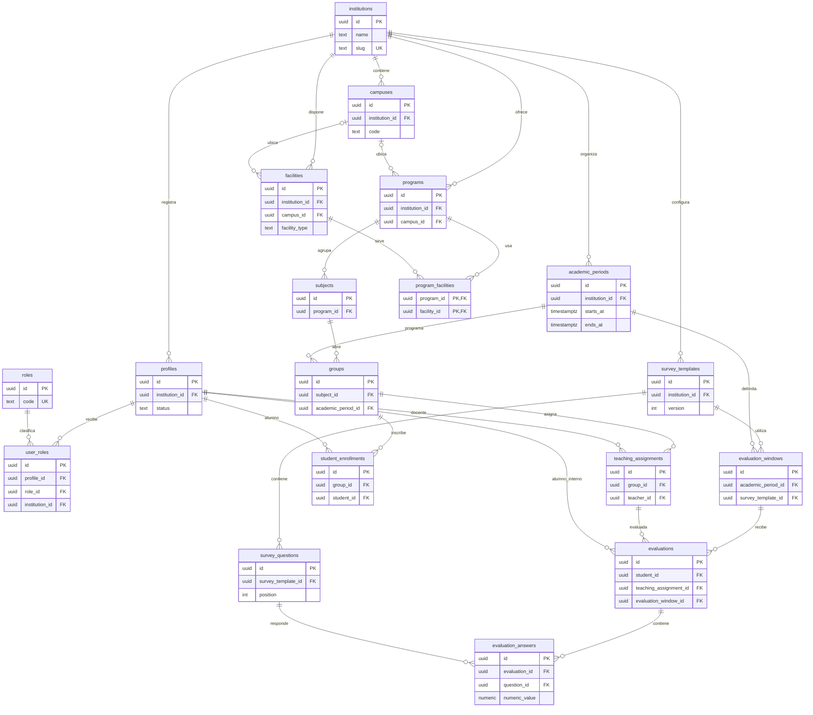

# DER lógico de EvalDoc

El diagrama representa las 18 tablas públicas del esquema final. `auth.users` es una entidad gestionada por Supabase Auth; `profiles.id` la referencia 1:1. Las relaciones con `institution_id` se implementan con claves compuestas donde se requiere aislamiento. Una plantilla global tiene `institution_id` nulo.

El DER es conceptual para lectura. El [diccionario](data-dictionary.md) y las [migraciones](../supabase/migrations/) son la referencia de tipos y cardinalidades exactas. Las evaluaciones y respuestas son privadas: las relaciones del diagrama no implican permiso de consulta.
