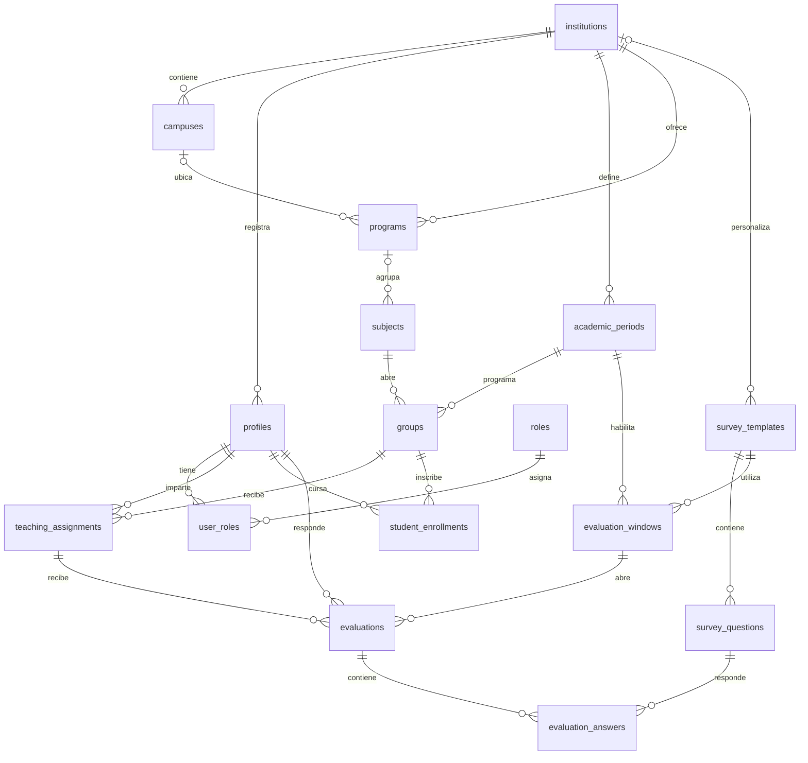

# Esquema de base de datos de EvalDoc

La migración `supabase/migrations/20260926071138_initial_evaldoc_schema.sql` define la base relacional y `20260926084254_auth_profiles_roles.sql` integra Auth, perfiles y roles iniciales. `supabase/seed.sql` añade solo siete instituciones de demostración y cinco roles. Login y registro usan Supabase; los datos académicos de los dashboards siguen siendo mock. No hay conexión con un proyecto Supabase remoto.

## Modelo y relaciones

| Área | Tablas | Propósito |
| --- | --- | --- |
| Organización | `institutions`, `campuses`, `programs`, `subjects`, `groups`, `academic_periods` | Catálogo académico por institución y periodo. |
| Personas | `profiles`, `roles`, `user_roles`, `teaching_assignments`, `student_enrollments` | Identidad institucional, roles múltiples, docencia e inscripción. |
| Encuestas | `survey_templates`, `survey_questions`, `evaluation_windows` | Cuestionario versionado y plazos para responder. |
| Respuestas | `evaluations`, `evaluation_answers` | Estado de cada evaluación y respuestas individuales privadas. |

### Aislamiento multiinstitución

Las entidades académicas y las evaluaciones llevan `institution_id`. Las claves foráneas compuestas comprueban que campus, programa, materia, grupo, periodo, docente y alumno pertenezcan a la misma institución. En asignaciones e inscripciones, `(institution_id, group_id, academic_period_id)` obliga a usar el periodo real del grupo. `evaluations.academic_period_id` enlaza simultáneamente la asignación y la ventana con ese mismo periodo. Las restricciones `UNIQUE (institution_id, id, ...)` existen para que PostgreSQL pueda usar esas claves foráneas compuestas; sus índices también sirven para filtrar por institución.

`profiles.id` es el mismo UUID de `auth.users.id`, ahora protegido por FK. Un perfil pertenece a una institución; si se requiere una misma cuenta de Auth en varias instituciones, habrá que revisar ese supuesto antes de ampliar Auth. `user_roles` permite varios roles distintos para un perfil en su institución; su restricción única impide duplicar el mismo rol. El campo opcional `institutional_identifier` cubre matrícula, número de cuenta o número de empleado, sin imponer un formato universal. Email e identificador son únicos por institución sin distinguir mayúsculas. No se guarda `last_sign_in_at`, porque Auth lo proporciona.

### Periodos, plantillas e histórico

Grupos, asignaciones, inscripciones, ventanas y evaluaciones apuntan al periodo académico. Así pueden consultarse el periodo actual, el anterior o los últimos tres, y calcular promedio, tendencia, mejor dimensión y área de oportunidad desde los datos base. No se guardan métricas derivadas ni se deben sobrescribir evaluaciones cerradas. El esquema todavía no impone inmutabilidad mediante trigger o política; el flujo de escritura y los permisos deberán hacerlo antes de usar datos reales.

`survey_templates.institution_id` puede ser nulo para plantillas compartidas. `version` es positivo y la pareja nombre-versión es única tanto para cada institución como para las plantillas compartidas. Cada nueva versión debe ser una fila nueva; las preguntas de una versión ya usada deben quedar intactas. `survey_questions` admite orden, dimensión, texto, obligatoriedad y tipo `scale` o `text`. La plantilla inicial podrá incluir dominio de la materia, planeación, claridad, participación, recursos didácticos, resolución de dudas, puntualidad, asistencia, cumplimiento del programa, retroalimentación, evaluación objetiva, uso de tecnología, trato respetuoso, motivación y satisfacción general. Esas 15 preguntas aún no forman parte del seed.

Una evaluación es única por estudiante, asignación docente y ventana. Sus estados `pending`, `in_progress` y `completed` exigen fechas coherentes. Cada pregunta solo puede tener una respuesta por evaluación; la respuesta no puede estar vacía. `numeric_value` admite cualquier número de 0 a 10, para permitir futuras plantillas. El cuestionario del prototipo presenta 0, 2.5, 5, 7.5 y 10. Nunca se calculan promedios sobre 5.

### Índices y marcas de tiempo

Las claves primarias y únicas cubren las búsquedas por perfil en `user_roles`, por docente en `teaching_assignments`, por estudiante en `student_enrollments` y `evaluations`, por evaluación en `evaluation_answers`, y por institución en los catálogos que comienzan con `institution_id`. Los índices adicionales cubren otros lados de las relaciones y filtros frecuentes: periodo, grupo, ventana, asignación, estado y pregunta. No se duplicaron esos índices de prefijo. Una sola función `set_updated_at()` actualiza las nueve tablas con `updated_at`.

## Anonimato y seguridad futura

`evaluations.student_id` se conserva internamente para impedir duplicados y calcular pendientes y participación. **Los docentes no deben consultar `student_id`, evaluaciones individuales ni respuestas individuales.** Una etapa posterior debe exponerles solo vistas o RPC agregadas seguras, con umbral mínimo de respuestas y sin parámetros que permitan reidentificar estudiantes. Recursos Humanos podrá derivar clasificaciones como Excelente, Bueno, Suficiente o No suficiente a partir de promedios y umbrales configurables; no se almacenan como dato permanente.

Todas las tablas públicas tienen RLS habilitada. La migración de Auth añade solo cuatro políticas de lectura: instituciones activas para el selector de registro, perfil propio, roles propios y catálogo de códigos de rol. No hay políticas de escritura cliente para `profiles`, `roles` o `user_roles`; las demás tablas académicas permanecen cerradas. RLS no protege frente a propietarios de tabla ni roles privilegiados que la omiten; ningún secreto o `service_role` debe llegar al frontend. La integración pendiente debe definir permisos multiinstitución completos, acceso agregado docente y comprobación de `profiles.status` en la base.

Los FK y CHECK no prueban que `teacher_id` posea el rol `teacher`, que `student_id` posea el rol `student`, que el alumno esté inscrito en el grupo evaluado, que la plantilla de una ventana pertenezca a su institución o sea global, ni que cada respuesta corresponda a una pregunta de esa plantilla y a su tipo. Tampoco comprueban que el envío esté dentro de la ventana o que se hayan contestado todas las preguntas obligatorias. Estas reglas necesitan un flujo transaccional de escritura y autorización en una etapa posterior; no deben dejarse a validaciones del navegador. Hasta entonces el esquema no debe recibir datos reales.

## Reproducción y validación

La fuente de verdad son las migraciones versionadas. `supabase db reset --local` reconstruye ambas migraciones y luego ejecuta `supabase/seed.sql`; borra los datos de la base local. Las dos migraciones y el seed se aplicaron correctamente en Supabase local. No se conectó ni modificó un proyecto remoto. Antes de habilitar datos académicos reales faltan pruebas de aislamiento entre instituciones, anonimato y reglas de cuestionario.
